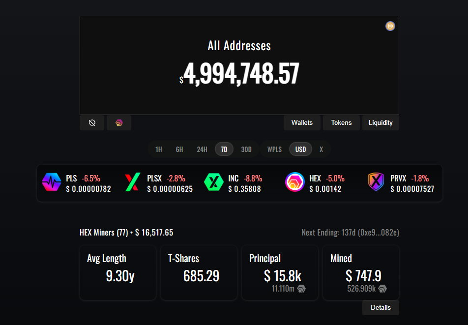

# 🚀 PulseChain Dashboard

Privacy-first portfolio tracker for PulseChain assets with real-time pricing and historical charting.

> Built for privacy. Runs locally. No tracking. No middlemen.

## 📸 Screenshots

PulseChain Dashboard provides an all-in-one desktop interface for tracking portfolios, HEX staking, liquidity positions, and multi-chain analytics.

<br>

<table>
<tr>
<td align="center"><strong>Dashboard Overview</strong></td>
<td align="center"><strong>Lifetime HEX DCA</strong></td>
</tr>

<tr>
<td align="center">

</td>
<td align="center">

</td>
</tr>

<tr>
<td align="center">
The complete portfolio dashboard with real-time balances, market data, and analytics.
</td>
<td align="center">
View your weighted lifetime HEX average entry price using historical purchases from Ethereum and PulseChain.
</td>
</tr>

<tr>
<td height="25"></td>
<td></td>
</tr>

<tr>
<td align="center"><strong>Multiple Wallet Tracking</strong></td>
<td align="center"><strong>Multi-Chain Analytics</strong></td>
</tr>

<tr>
<td align="center">

</td>
<td align="center">

</td>
</tr>

<tr>
<td align="center">
Track multiple wallets simultaneously while keeping balances organized.
</td>
<td align="center">
Analyze purchases across multiple wallets and both supported blockchains using a combined weighted average entry price.
</td>
</tr>
</table>

## 🚀 v2.2.0 — Lifetime HEX DCA & Multi-Chain Purchase Tracking

This release introduces one of the biggest upgrades to PulseChain Dashboard yet: **lifetime HEX dollar-cost averaging (DCA)** with historical purchase reconstruction across both Ethereum and PulseChain.

### ✨ New Features

- 📈 Lifetime HEX Dollar-Cost Average (DCA) tracking
- ⛓️ Automatic reconstruction of lifetime HEX purchases across Ethereum and PulseChain
- 💰 Historical pricing using archived market data with automatic fallbacks
- 🧮 Weighted lifetime average entry price calculation
- 🌐 Combined multi-chain purchase history
- 📊 Network-by-network purchase breakdown
- 👛 Wallet-by-wallet DCA breakdown
- 📉 Current profit/loss and return percentage based on your average entry

### ⚡ Performance

- Persistent caching of transaction history for dramatically faster reloads
- Cached historical pricing to reduce API requests
- Live progress updates while scanning wallet history
- Improved reliability when processing large transaction histories

### 🎨 UI / UX

- Added **DCA Price** card to the HEX Miners dashboard
- Detailed hover tooltip showing:
  - Average Entry
  - Current Price
  - Current Value
  - Total Spent
  - Total HEX Purchased
  - Network Breakdown
  - Wallet Breakdown
- Improved tooltip positioning for large data sets

### 🛠 Under the Hood

- Added Ethereum pre-PulseChain transaction scanning
- Added dual-chain transaction scanning across Ethereum and PulseChain
- Improved transaction parsing for routed swaps and multicall transactions
- Added historical price lookup fallbacks for improved pricing accuracy
- Improved error handling and recovery when historical pricing is unavailable
- Reduced unnecessary blockchain requests through smarter caching

---

## 🚀 v2.1.3 — Price Accuracy & Metrics Sync

This update focuses on improving price accuracy, percent tracking, and overall calculation reliability.

### 🔧 Improvements
- Synced % change calculations with **PulseCoinList** for consistent market data
- Improved reliability of **1H / 6H / 24H / 7D / 30D** calculations across all tokens
- Better handling of USD vs WPLS conversions using stable pair logic
- Enhanced fallback logic for missing or inconsistent historical data

### 📊 Accuracy Fixes
- Fixed issue where % changes were stuck at **0.0%**
- Fixed incorrect **24H calculations** drifting from real market values
- Fixed mismatch between dashboard values and external data sources
- Improved handling of candle-based vs API-based price anchoring

### 🧠 Under the Hood
- Integrated PulseCoinList metrics as a **reliable override layer**
- Added caching for last known good % values to prevent flickering/resetting
- Improved denominator stability to prevent calculation collapse
- Cleaned up debug logging and reduced console noise

---

## 🚀 v2.1.2 — UX & Watchlist Upgrade

This release improves token management, hidden-token recovery, and bulk watchlist workflows.

### ✨ New Features
- Added **Add All Results** button for fast bulk token imports
- Hidden tokens now reappear during **Scan** so they can be restored
- Added seamless restore flow for previously hidden default tokens

### 🎨 UI/UX
- Default tokens can now be hidden instead of silently failing to remove
- Improved Token Watchlist layout with balanced action buttons
- Hidden tokens are clearly labeled in scan results
- Cleaner token management workflow

### 🐛 Fixes
- Fixed issue where default tokens from Ethereum could not be removed
- Fixed hidden-token recovery and re-add behavior
- Improved watchlist consistency when adding multiple scan results

---

## 🚀 v2.1.1 — Performance & Accuracy Patch

This patch focuses on improving performance, fixing calculation edge cases, and polishing the overall user experience.

### 🔧 Improvements
- Added smart candle caching for faster startup and reduced API calls
- Wallet % change now calculated across **all tokens**, not just core assets
- Improved reliability of price calculations using historical data
- Automatic update check on startup (no manual interaction required)

### 🎨 UI/UX
- Added **“Support the developer”** section with copy-to-clipboard
- Improved loading indicator positioning and alignment
- Fixed sidebar layout issues and spacing inconsistencies
- Better visual feedback for update status (“Up To Date” / “Update Available”)

### 🐛 Fixes
- Fixed PRVX % showing incorrect values (including -100% bug)
- Fixed WPLS % inconsistencies and delayed calculations
- Fixed chart-related crashes when loading certain tokens
- Resolved multiple console errors and edge case failures

---

## 🚀 v2.1.0 — Stability & Charting Update

This release focuses on improving reliability, performance, and overall user experience.

### 🔧 Improvements
- Fixed incorrect % changes (1H, 6H, 24H, 7D, 30D)
- Standardized chart logic using hourly candle data
- Improved chart loading behavior for non-core tokens
- Added fallback handling for tokens missing price data
- Fixed duplicate tokens appearing in wallet scans
- Allow removal of tokens even if they fail to load
- Improved token image loading with better fallback logic

### 🎨 UI/UX
- Improved spacing and layout consistency
- Fixed token row alignment issues
- Version display now reflects actual app version dynamically

### 🛠️ Under the Hood
- Reduced reliance on unreliable external price sources
- Improved caching behavior for chart data
- Stabilized modal + chart rendering

---

## 📦 Download

👉 **Latest Release:**
https://github.com/exodus2020/Pulsechain-Dashboard/releases

* **Windows Installer** (recommended)
* **Portable Version** (no install required)

⚠️ Notes:

* This app is not code-signed yet
* Windows may show a security warning → click **More Info → Run Anyway**

---

## 🌐 Web Version

Prefer browser access?
👉 https://plsdashboard.link/

---

## 🧠 What is PulseChain Dashboard?

PulseChain Dashboard is an open-source desktop application that lets you track your PulseChain portfolio and interact with the ecosystem — without relying on centralized services.

All data is stored locally and encrypted for maximum privacy.

---

## ✨ Features

* 📊 Track PulseChain token balances
* 💧 Monitor PulseX liquidity positions
* 🌾 View farming positions and rewards
* 🔐 Fully local + encrypted data storage
* ⚡ Real-time price updates
* 🧾 HEX stake tracking and analytics
* 📈 Lifetime HEX DCA tracking across Ethereum & PulseChain
* 🔧 Custom RPC endpoints
* 📁 Import / export encrypted portfolios
* 🖥️ Cross-platform (Windows, MacOS, Linux)

---

## 🛠️ Run from Source

### Prerequisites

* Node.js (v16+)
* npm (v7+)
* Git
* Python (v3.7+) + pip (for build dependencies)

Install Python dependencies:

```bash
pip install setuptools wheel
```

---

### 1. Clone the repository

```bash
git clone https://github.com/exodus2020/Pulsechain-Dashboard.git
cd Pulsechain-Dashboard
```

---

### 2. Install dependencies

```bash
npm install
```

---

### 3. Run in development

```bash
npm run dev
```

---

### 4. Build the application

```bash
npm run electron:build
```

Output will be located in:

```bash
dist_electron/
```

---

## 🧪 Platform Notes (Optional)

If you prefer manual setup:

**MacOS (Homebrew):**

```bash
brew install node git python
pip3 install setuptools wheel
```

**Ubuntu / Debian:**

```bash
sudo apt install nodejs npm git python3 python3-pip
pip3 install setuptools wheel
```

**Fedora:**

```bash
sudo dnf install nodejs npm git python3 python3-pip
pip3 install setuptools wheel
```

---

## 🔐 Security

PulseChain Dashboard is designed with privacy as a core principle:

* All data is stored locally
* No external tracking or analytics
* User-controlled RPC endpoints
* dApps loaded from official sources only

---

## ⚠️ Disclaimer

This is an independent open-source project and is not officially affiliated with PulseChain.
